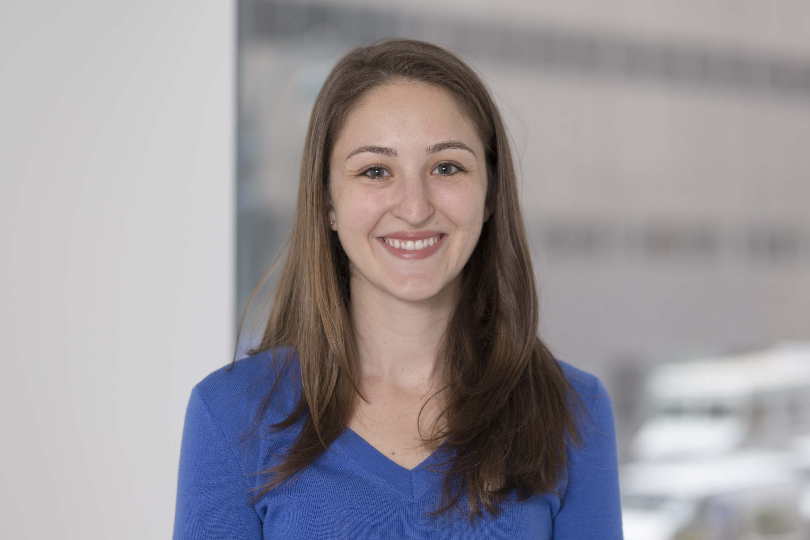

I work as a Research Biostatistician in the Department of Epidemiology & Biostatistics at [Memorial Sloan Kettering Cancer Center](https://www.mskcc.org/departments/epidemiology-biostatistics). I graduated from UNC Chapel Hill with a MS in Biotatistics in 2014, where my master's thesis investigated methods of handling missing data in type I diabetes clinical trials.   

I have worked in various therapeutic areas including autoimmune disease, obstetrics and gynecology, orthopedics, and oncology, whre I have applied statistical methods such as age-period-cohort analyses, mediation analyses, and hierarchical models, among others. Currently, I am exploring the methodological challenges and practical considerations of publicly profiling providers of surgical cancer care.  Click the link above to explore my portfolio for more details about what I'm working on and a select snapshot of previous projects.
